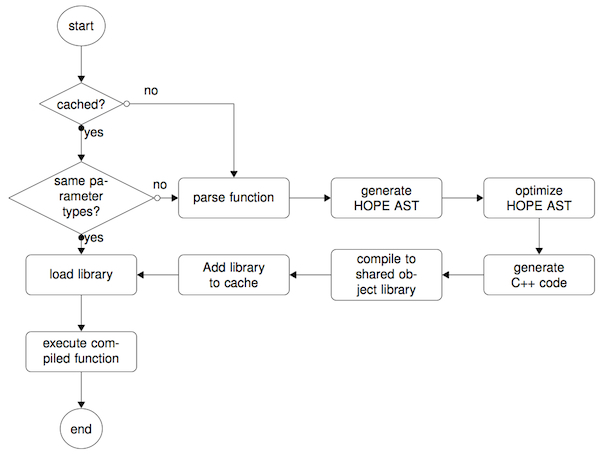

Hope Architecture
=================

The Just-in-time compiling process undergoes several steps. Those steps are explained in the following and detailed in an :ref:`example` and in a dedicated :ref:`optimization` section:

**Start** The Python interpreter loads a function or method previously decorated with the ``@hope.jit`` decorator.

**Cache verification** **HOPE** checks if a compiled version of the requested functions has previously been cached.

**Parse function** The first time the decorated function is called, the wrapper generates an abstract syntax tree (AST) by parsing the function definition using the Python built-in ``ast`` package.

**Generate HOPE AST** Using the visitor pattern, the Python AST is traversed and a corresponding **HOPE** specific AST is generated. During the traversal we use the Python built-in ``inspect`` package to infer the data types of the live objects such as parameters, variable and return values.

**Numerical optimization** **HOPE** traverses the new AST in order to identify numerical optimization possibilities and alters the tree accordingly.

**Generate C++ code** A C++ code is generated from the **HOPE** AST.

**Compile code to shared object library** The Python built-in ``setuptools`` package is then used to compile a shared object library from the generated code. 

**Add library to cache** Using the extracted information from the function signature and a hash over the function body the compiled shared object library is cached for future calls. 

**Load library** The shared object library is dynamically loaded into the runtime.

**Execute compiled function** A call to the function is directed to the function in the shared object library and executed with the passed parameters.

**Subsequent function call** **HOPE** analyzes the types of the passed arguments and queries the cache for a function matching the requested name and arguments.

Further reading
---------------

.. toctree::
   :maxdepth: 1

   example
   optimization
